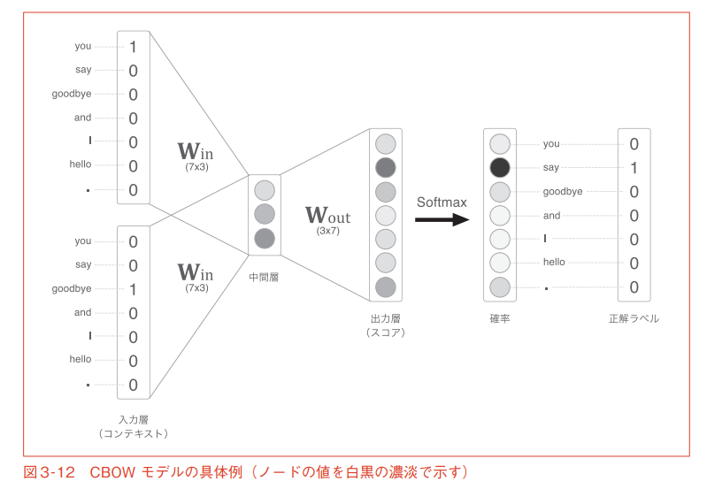

## word2vec
1. どこからこのアルゴリズムが湧いてきたのか→分布仮説  
→アルゴリズムの解説

分布仮説：
→周辺n単語に出る単語の分布が近いものほど近いベクトルになる  
分布仮説に関するNNモデルが2つある
- CBOW
- Skip-gram

CBOW  
アルゴリズム：  
入力層：注目する単語、文脈
注目している単語の確率が高くなるように重みを更新  
W_inが得られる分散表現で、各行に各単語のベクトルが含まれている

カウントベースでの例→計算量多いから推論ベースに  
カウントベース：各単語を表す際、文脈の数個が1になっている疎なベクトルを用いる  
推論ベース：

2. 得られた表現はなぜ加法構成性を持つのか

加法構成性：単語ベクトルの足し引きと、それらの単語の意味的な足し引きが対応する性質
$$ \boldsymbol{u_{man}} + \boldsymbol{u_{royal}} \approx \boldsymbol{u_{king}} $$
$$"man"+"royal" = "king"$$

[Skip-Gram - Zipf + Uniform = Vector Additivity](http://www.lr.pi.titech.ac.jp/~haseshun/acl2017suzukake/slides/09.pdf)  
[word2vecのあらわす意味とは何か調べてみた](https://qiita.com/suzuki_sh/items/850b282cad5f189e7c4d)

苦手なこと：類義語、対義語の区別　出現頻度の少ない単語を正確に表現する